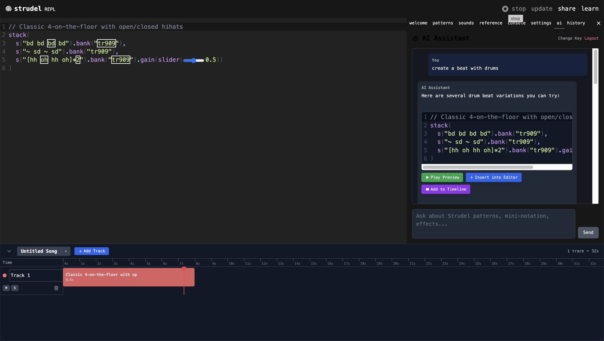

# strudel



Live coding patterns on the web
https://blamy.github.io/strudel/

- Try it here: <https://blamy.github.io/strudel/>
- Docs: <https://strudel.cc/learn>
- Technical Blog Post: <https://loophole-letters.vercel.app/strudel>
- 1 Year of Strudel Blog Post: <https://loophole-letters.vercel.app/strudel1year>
- 2 Years of Strudel Blog Post: <https://strudel.cc/blog/#year-2>

## Running Locally

After cloning the project, you can run the REPL locally:

1. Install [Node.js](https://nodejs.org/)
2. Install [pnpm](https://pnpm.io/installation)
3. Install dependencies by running the following command:
   ```bash
   pnpm i
   ```
4. Run the development server:
   ```bash
   pnpm dev
   ```

## AI Assistant (Vibe Coder)

Strudel includes an AI assistant powered by Claude (Anthropic) that helps you create patterns, understand mini-notation, and explore Strudel's capabilities. The AI assistant provides:

- **Pattern Generation**: Ask for help creating patterns, and get multiple variations with preview capabilities
- **Code Validation**: Generated code is automatically validated for syntax errors
- **Context Awareness**: The assistant understands your current code and selected timeline segments
- **Interactive Previews**: Preview generated patterns before inserting them into your editor
- **Timeline Integration**: Add generated patterns directly to timeline tracks

### Using the AI Assistant

1. Open the AI tab in the REPL panel
2. Authenticate using your device's passkey (Face ID, Touch ID, Windows Hello, etc.)
3. Enter your Anthropic API key (get one from [console.anthropic.com](https://console.anthropic.com/))
4. Start asking questions about Strudel patterns, effects, and mini-notation

### API Key Storage & Security

Your API keys are stored securely using industry-standard encryption:

- **Passkey Authentication**: Uses WebAuthn for passwordless, biometric authentication
- **Encrypted Storage**: API keys are encrypted with AES-GCM 256-bit encryption before being stored in localStorage
- **Key Derivation**: Encryption keys are derived from your passkey credentials using PBKDF2 (100,000 iterations)
- **Local-Only**: Your API keys never leave your device and are never stored in plaintext
- **No Server Storage**: All encryption/decryption happens in your browser - we never see your keys

The encryption system ensures that even if someone gains access to your browser's localStorage, they cannot decrypt your API keys without your passkey authentication.

## Using Strudel In Your Project

This project is organized into many [packages](./packages), which are also available on [npm](https://www.npmjs.com/search?q=%40strudel).

Read more about how to use these in your own project [here](https://strudel.cc/technical-manual/project-start).

You will need to abide by the terms of the [GNU Affero Public Licence v3](LICENSE). As such, Strudel code can only be shared within free/open source projects under the same license -- see the license for details.

Licensing info for the default sound banks can be found over on the [dough-samples](https://github.com/felixroos/dough-samples/blob/main/README.md) repository.

## Contributing

There are many ways to contribute to this project! See [contribution guide](./CONTRIBUTING.md). You can find the full list of contributors [here](https://codeberg.org/uzu/strudel/activity/contributors).

## Community

There is a #strudel channel on the TidalCycles discord: <https://discord.com/invite/HGEdXmRkzT>

You can also ask questions and find related discussions on the tidal club forum: <https://club.tidalcycles.org/>

The discord and forum is shared with the haskell (tidal) and python (vortex) siblings of this project.

We also have a mastodon account: <a rel="me" href="https://social.toplap.org/@strudel">social.toplap.org/@strudel</a>
